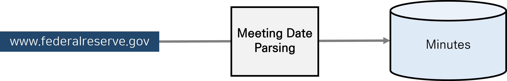

# Collecting FOMC Minutes

* For additional information, please contact us using the email addresses provided below.
    - jihyeparkk@bdai.snu.ac.kr 
    - hjkim@bdai.snu.ac.kr

* Reference
    - Scraping: https://github.com/tengtengtengteng/Webscraping-FOMC-Statements
    - Data source: https://www.federalreserve.gov/monetarypolicy/materials/
    
## Guidelines for SNU BDAI members only
* **Chrome Driver**를 알맞은 버전으로 다운로드 받은 후 Chrome Driver의 파일 경로를 `main.py` 파일 내 `chromedriver_filepath`에 입력해주세요.
* `config.py` 파일에 정보를 입력하여 `main_scrape_and_remove_stop_phrases.py`와 같은 위치에 저장해주세요.
    * `config.py`
```bash
dialect = ''
host = ''
port = ''
user = ''
pw = ''
db = ''
minio_api_endpoint = ''
```

* DB 적재를 위해 다음과 같은 커맨드를 실행해주세요. 
```bash
python main.py --start_mmddyyyy "01/01/1993" --end_mmddyyyy "07/01/2023" --insert_into_NRFDB "True"
```

## Overview


### Input
| Variable           | Type | Example                                                             |
| :----------------- | :--- | :------------------------------------------------------------------ |
| start\_mmddyyyy    | str  | "01/01/1990"                                                        |
| end\_mmddyyyy      | str  | "01/25/2023"                                                        |
| chromedriver\_filepath | str  | "C:\\GIT\\SELENIUM\_DRIVERS\\chromedriver\_win32\\chromedriver.exe" |
| save\_temp\_dir    | str  | "./Temp"                                                      |

## Error Handling
* If an error occurs, the case is saved in the `Minutes/raw/errors.csv` file.
* After checking this file, handle the errors one by one.